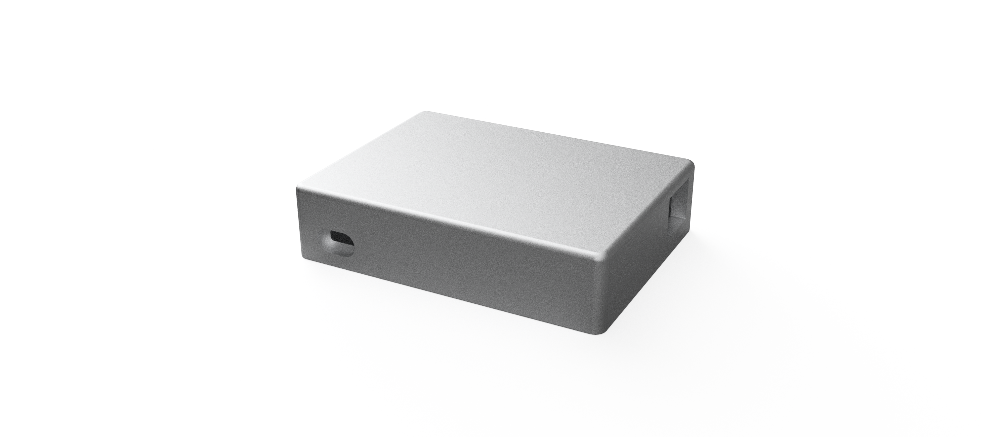

[← Back to Root](https://github.com/httperry/snoopy)

# Enclosure

3D-printed enclosure for Snoopy, designed in Fusion 360. Split into a top and bottom shell that sandwich the PCB

---

---

## Exports

| File | Format | Description |
|---|---|---|
| [Snoopy.f3d](./Snoopy.f3d) | F3D | Full assembly Fusion 360 source file |
| [Snoopy.step](./Snoopy.step) | STEP | Full assembly STEP export (for slicing / import) |
| [TopShell.f3d](./TopShell.f3d) | F3D | Top shell Fusion 360 source |
| [BottomShell.step](./BottomShell.step) | STEP | Bottom shell STEP export |
