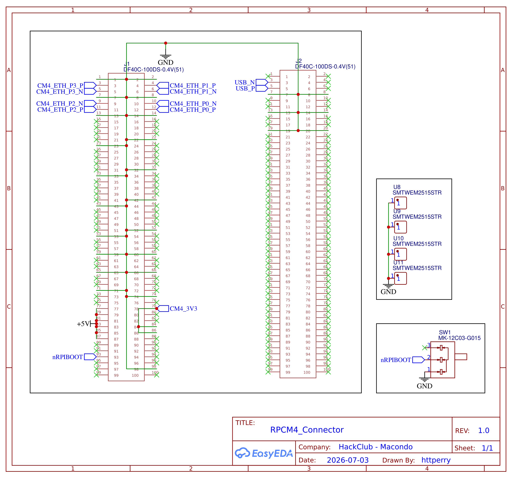

[← Back to Root](https://github.com/httperry/snoopy)

# CM4 Connections

Covers the interface between the board and the Raspberry Pi CM4. The CM4 connects through two high-density 100-pin DF40C board-to-board connectors (J1, J2), which carry power, USB, PCIe, HDMI, and the RGMII signals that feed into the RTL8367S switch. Also includes the USB-C port for programming and a reset/boot switch

---

---

## Exports

| File | Format |
|---|---|
| [RPCM4_Schematic.pdf](./RPCM4_Schematic.pdf) | PDF |
| [RPCM4_Schematic.png](./RPCM4_Schematic.png) | PNG |
| [RPCM4_Connector_2026-07-06.svg](./RPCM4_Connector_2026-07-06.svg) | SVG |

---

## Key Components

| Component | Part | Function |
|---|---|---|
| J1, J2 | DF40C-100DS-0.4V(51) | CM4 board-to-board connectors (100-pin, 0.4mm pitch) |
| USBC1 | TYPE-C-31-M-12 | USB-C port for CM4 programming |
| SW1 | MK-12C03-G015 | Power / boot select switch |
| U12, U13 | LM66100DCKR | Ideal diode for power rail protection |
| U7 | FTC201610S2R2MBCA | 2.2µH inductor for CM4 supply filtering |
