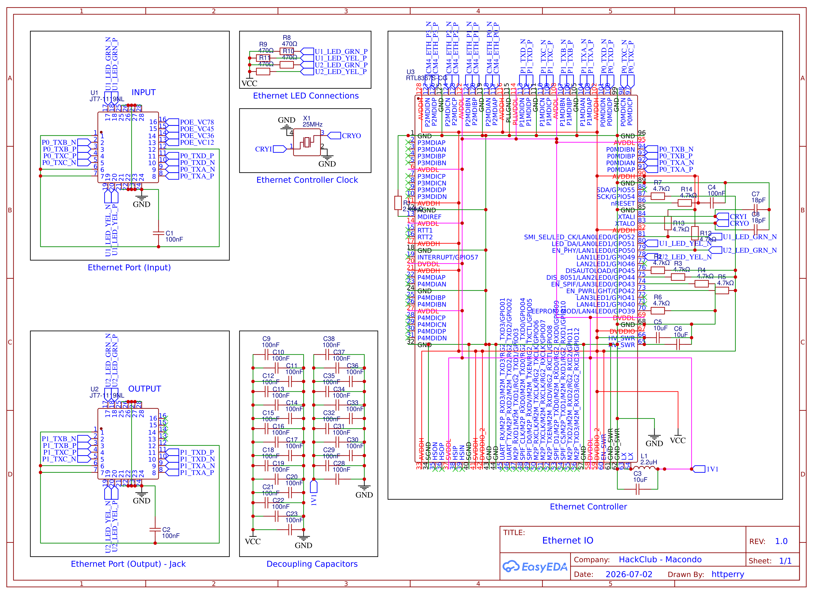

[← Back to Root](https://github.com/httperry/snoopy)

# Ethernet Connections

The switch fabric and physical layer connections. The RTL8367S acts as the 3-port GbE switch IC, with two ports broken out to integrated MagJack connectors (JT7-1119NL) and the third port connecting internally to the CM4's RGMII interface. Pulse transformers (SMTWEM2515STR) handle the magnetics for each port, and a 25MHz crystal provides the reference clock

---

---

## Exports

| File | Format |
|---|---|
| [Ethernet_Schematic.pdf](./Ethernet_Schematic.pdf) | PDF |
| [Ethernet_Schematic.png](./Ethernet_Schematic.png) | PNG |
| [Ethernet_IO_2026-07-06.svg](./Ethernet_IO_2026-07-06.svg) | SVG |

---

## Key Components

| Component | Part | Function |
|---|---|---|
| U3 | RTL8367S-CG | 3-port Gigabit Ethernet switch IC |
| U1, U2 | JT7-1119NL | Integrated MagJack (GbE RJ45 with magnetics) |
| U8–U11 | SMTWEM2515STR | Ethernet pulse transformers |
| X1 | TAXM25M4RLBCCT2T | 25MHz reference crystal |
| D1 | USBLC6-2SC6 | ESD protection |
