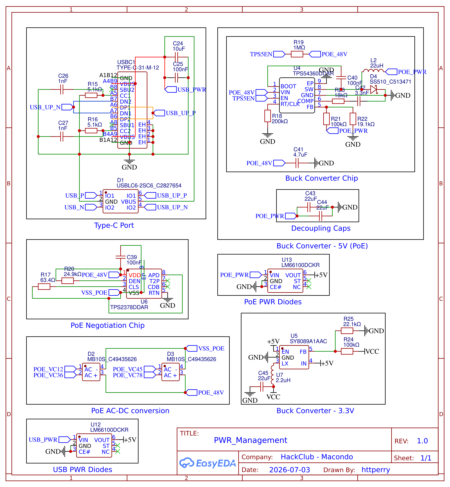

[← Back to Root](https://github.com/httperry/snoopy)

# PWR Management

Handles all power rails on the board. Takes input via USB-C or PoE, steps it down to the voltages needed by the CM4, the RTL8367S switch, and other ICs. Uses two buck converters (TPS54360 and SY8089) alongside a PoE PD controller (TPS2378) and a pair of LM66100 ideal diode controllers for input source arbitration

---

---

## Exports

| File | Format |
|---|---|
| [PWR_Management_Schematic.pdf](./PWR_Management_Schematic.pdf) | PDF |
| [PWR_Management_Schematic.png](./PWR_Management_Schematic.png) | PNG |
| [PWR_Management_2026-07-06.svg](./PWR_Management_2026-07-06.svg) | SVG |

---

## Key Components

| Component | Part | Function |
|---|---|---|
| U4 | TPS54360DDAR | Main 60V/3.5A buck converter |
| U5 | SY8089A1AAC | 3A synchronous buck for CM4 core |
| U6 | TPS2378DDAR | PoE PD controller |
| U12, U13 | LM66100DCKR | Ideal diode / input OR-ing |
| D2, D3 | MB10S | Bridge rectifier for PoE input |
| D4 | SS510 | Schottky protection diode |
| L1 | ZEMS16086S-2R2M | 2.2µH power inductor |
| L2 | YSPI0630A-220M | 22µH power inductor |
